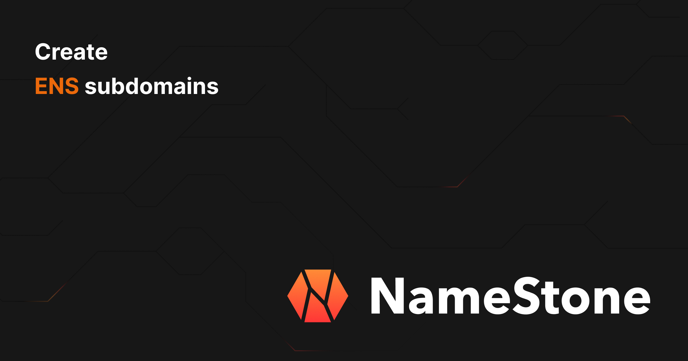

<p align="center">
  <picture>
  
</picture>
</p>

## Table of contents

- <a href="#about">What is Namestone?</a>
- <a href="#how-it-works">How it works</a>
- <a href="#getting-started">Getting Started</a>

<h2 id="about">What is Namestone?</h2>

Namestone is a web3 identity management platform that enables domain owners to create and manage subdomains using ENS (Ethereum Name Service) wildcard resolution. It allows domain owners to programmatically create and manage subdomains for their users, making it easier to build identity and naming systems on Ethereum.

<h2 id="how-it-works">How it works</h2>

Namestone leverages ENSIP-10 wildcard resolution to enable dynamic subdomain resolution without requiring individual ENS registrations. Here's how:

1. Domain owners set up wildcard resolution for their ENS domain (e.g., *.domain.eth)
2. Through Namestone's API, they can:
   - Create subdomains dynamically
   - Manage text records and coin addresses for each subdomain
   - Update and revoke subdomains as needed
3. All subdomains are resolved through the wildcard resolver, making them instantly available on ENS

This approach provides several benefits:
- No gas costs for subdomain creation
- Instant subdomain availability
- Centralized management for domain owners
- Full compatibility with ENS tooling and infrastructure

## Getting Started

### Prerequisites

#### Node.js and Yarn
- [Node.js](https://nodejs.org/en/download/)
- [Yarn](https://yarnpkg.com/getting-started/install)

Ensure Node.js and Yarn are properly installed by running:

```bash
node --version
yarn --version
```

#### Postgres

You can install Postgres in a number of ways.

##### Local Installation

1. Download and install [Postgres](https://www.postgresql.org/download/)

2. See [Prisma guide](https://www.prisma.io/dataguide/postgresql/setting-up-a-local-postgresql-database) for instructions on how to set up a local postgres database.

```bash
brew services start postgresql
```

3. Connect to the database: ```psql -h localhost -U postgres -d namestone-postgres```

##### Docker Installation

1. Install [Docker Desktop](https://www.docker.com/products/docker-desktop/)

2. Verify Docker installation: ```docker --version```

3. Run the following command to start the postgres container:

```bash
docker run --name namestone-postgres -e POSTGRES_PASSWORD=namestone -d postgres
```

4. Verify the container is running: ```docker ps```

5. Connect to the database: ```psql -h localhost -U postgres -d namestone-postgres```

### Development Setup

To get it running, follow the steps below:

1. Install dependencies:
```bash
yarn install
```

2. Configure environment variables:

Start by copying the example environment file to a new file called `.env`:
```bash
cp .env.example .env
```

Edit the `.env` file with your own values.

3. Push the database migrations to the database:

```bash
npx prisma db push
```

### Optional: Seed the database

To seed the database with test data, run:

```bash
node ./prisma/seed.js
```

The seed scripts create the following domains and API keys:

| Network | Domain | API Key |
|---------|---------|----------|
| mainnet | test-mainnet.eth | test-api-key-mainnet |
| mainnet | second-mainnet.eth | second-test-api-key-mainnet |
| sepolia | test-sepolia.eth | test-api-key-sepolia |
| sepolia | second-sepolia.eth | second-test-api-key-sepolia |

Each domain includes:
- Multiple subdomains with text records and coin types:
  - Primary domains: test1, test2, test3, rob, robert, alice
  - Secondary domains: other1, other2, other3, rob-other, ronald, anna
- Brand settings (shareWithDataProviders enabled/disabled)
- Network-specific configuration

You can use these credentials to test the API endpoints locally. For example:
```bash
curl -X GET "http://localhost:3000/api/public_v1/get-names?domain=test-mainnet.eth" \
  -H "Authorization: test-api-key-mainnet"
```

#### Running the development server

Run the development server:

```bash
yarn dev
```

Open [http://localhost:3000](http://localhost:3000) to interact with the application or make API requests.

## Tests

### API route tests

API route tests are colocated next to the route itself, i.e. `pages/api/[network]/set-name.js` and `pages/api/[network]/set-name.test.js`.
The API route tests are ran using `jest` against a local postgres instance.

Please see `.env.test` for the test database credentials and local port.

#### Running tests

```bash
yarn test
```

#### Coverage

Coverage reports are generated in the `coverage` directory. To view the coverage report, open `coverage/index.html` in your browser.

